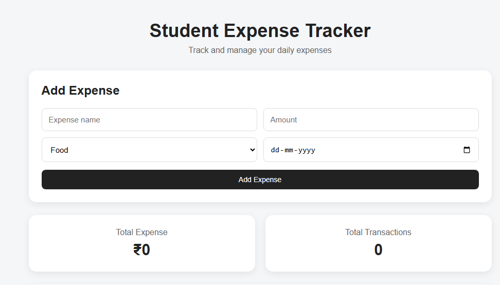

# 💰 Student Expense Tracker



A simple and responsive web application to track daily expenses.

## 🚀 Live Demo

https://vishal400402-create.github.io/student-expense-tracker/

## 📌 Features

- ➕ Add new expenses
- ✏️ Edit existing expenses
- 🗑️ Delete expenses
- 💾 Save expenses using LocalStorage
- 💰 Calculate total expenses
- 🔢 Count total transactions
- 🔍 Search expenses
- 📂 Filter expenses by category
- 🧹 Clear all expenses
- 📅 Select expense date
- 📱 Responsive design for mobile devices
- ⚠️ Form validation
- ✅ Confirmation before deleting all expenses

## 🛠️ Technologies Used

- HTML
- CSS
- JavaScript
- LocalStorage
- Git & GitHub

## 📂 Project Structure

```text
Expense Tracker
│
├── index.html
├── style.css
├── script.js
└── README.md